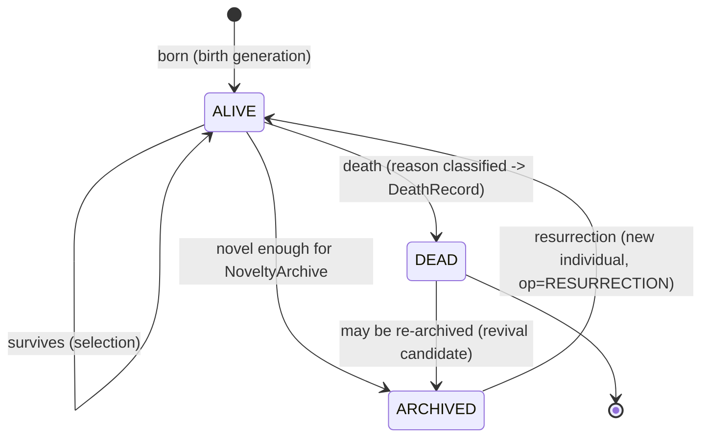
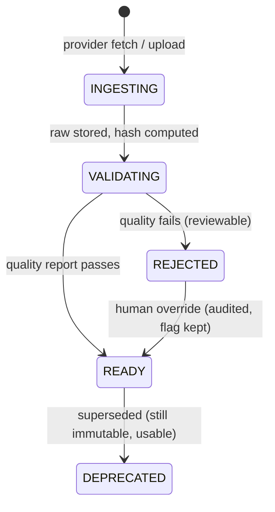

# EVOLTRADE — DOMAIN MODEL

Objects, relationships, state machines, and invariants. Money fields are marked **₤** (Decimal).
IDs: ULID unless stated. All timestamps UTC nanosecond.

## 1. Relationship overview

```mermaid
erDiagram
    MARKET_INSTRUMENT ||--o{ DATASET_VERSION : "is in"
    DATASET_VERSION ||--o{ EVENT_LOG : "materializes as"
    EXPERIMENT }o--|| DATASET_VERSION : "runs on"
    EXPERIMENT }o--o| STRATEGY : "uses"
    EXPERIMENT ||--o{ RUN : "contains"
    EXPERIMENT ||--o{ RESULT : "produces"
    EXPERIMENT ||--o{ EVENT_LOG : "records"
    EXPERIMENT }o--o| EXPERIMENT : "parent (counterfactual)"
    EXPERIMENT ||--o{ REPLAY_SESSION : "can replay"
    RUN ||--o{ ORDER : "emits"
    ORDER ||--o{ FILL : "produces"
    ORDER }o--|| ACCOUNT : "belongs to"
    FILL ||--o{ LEDGER_ENTRY : "journals to"
    FILL ||--o| POSITION : "affects"
    FEE }o--|| FILL : "on"
    FUNDING_ACCRUAL }o--|| POSITION : "on"
    ACCOUNT ||--o{ LEDGER_ENTRY : "owns"
    ACCOUNT ||--o{ POSITION : "holds"
    PORTFOLIO ||--exactly-one-- ACCOUNT : "wraps"
    PORTFOLIO ||--o{ PORTFOLIO_SNAPSHOT : "samples"
    STRATEGY }o--|| STRATEGY_GENOME : "compiled from"
    STRATEGY_GENOME ||--o{ INDIVIDUAL : "embodied in"
    INDIVIDUAL ||--o{ LINEAGE_EDGE : "parent/child"
    INDIVIDUAL ||--o| DEATH_RECORD : "dies as"
    INDIVIDUAL ||--o{ EXPERIMENT : "evaluated by"
    INDIVIDUAL }o--o| NOVELTY_ARCHIVE : "may be archived"
    POPULATION ||--o{ INDIVIDUAL : "contains"
    POPULATION }o--o| POPULATION : "superseded by generation"
    GENERATION ||--|| POPULATION : "snapshot of"
    EVOLUTION_RUN ||--o{ GENERATION : "produces"
    EVOLUTION_RUN }o--|| EXPERIMENT : "is tracked as"
    TOURNAMENT ||--o{ TOURNAMENT_ENTRY : "ranks"
    TOURNAMENT_ENTRY }o--|| INDIVIDUAL : "of"
    TOURNAMENT }o--|| SCENARIO : "mode preset"
    SCENARIO }o--|| EXPERIMENT : "materializes as"
    REGIME_SERIES }o--|| DATASET_VERSION : "derived from"
    REGIME }o--|| REGIME_SERIES : "label in"
    RISK_POLICY }o--|| EXPERIMENT : "applied in"
    RISK_DECISION }o--o| ORDER : "on"
    EXECUTION_POLICY }o--|| STRATEGY_GENOME : "embedded in"
    FITNESS_METRIC }o--|| INDIVIDUAL : "scores"
    EXPERIMENT }o--o| ROBUSTNESS_REPORT : "passes"
    MONTE_CARLO_RUN }o--|| EXPERIMENT : "samples"
    SENSITIVITY_STUDY }o--|| EXPERIMENT : "perturbs"
    CAPACITY_STUDY }o--|| EXPERIMENT : "scales"
    WALK_FORWARD_PLAN ||--o{ EXPERIMENT : "windows are"
    REPLAY_SESSION ||--o{ REPLAY_COMMAND : "receives"
    KILL_SWITCH_STATE }o--|| PORTFOLIO : "guards"
    AUDIT_ENTRY ||--o{ AUDIT_ENTRY : "hash-chained"
```

## 2. Market domain

### MarketInstrument
- `instrument_id` (ULID), `symbol`, `asset_class` (crypto_perp|crypto_spot|equity|fx|future),
  `venue` (exchange or "synthetic"), `currency_quote`, `currency_settle`
- **₤ tick_size**, **₤ step_size**, `min_quantity` ₤, `min_notional` ₤, `price_precision`, `qty_precision`
- `margin_profile` (initial %, maintenance %), `funding_supported` bool
- Invariant: tick/step > 0; min_notional ≥ 1 quote unit

### Tick / Quote / Trade (event payloads, stored in Event Log)
- `Tick { instrument_id, ts_ns, bid, ask, bid_qty, ask_qty }` ₤ prices
- `Trade { trade_id, instrument_id, ts_ns, price ₤, qty ₤, side, aggressor }`
- Invariant: quote requires bid < ask (else `INVALID_QUOTE` data event); trade price ≥ 0

### OrderBook (state object, rebuilt from events)
- Bid levels / ask levels (price ₤, qty ₤, [queue metadata per model]), `best_bid`, `best_ask`
- Derived: `spread`, `mid`, `microprice`, `depth(levels)`, `estimated_execution_price(side, qty, model)`
- `book_state`: OK | DEGRADED (update gap, resync pending) | SYNTHETIC (T0)
- Invariant: levels strictly ordered; qty > 0 per level; DEGRADED ⇒ fills labeled

## 3. Execution domain

### Order
- `order_id`, `cl_order_id` (idempotency key), `experiment_id`, `run_id`, `strategy_id` (owner),
  `instrument_id`, `side` (BUY/SELL), `order_type` (MARKET|LIMIT|STOP|STOP_LIMIT|TAKE_PROFIT|TRAILING_STOP)
- `time_in_force` (GTC|GTD|IOC|FOK), `flags` (POST_ONLY, REDUCE_ONLY, FORCED_LIQUIDATION)
- `limit_price` ₤, `stop_price` ₤, `trailing_distance` ₤, `qty` ₤, `filled_qty` ₤, `remaining_qty` ₤
- `state` (see state machine), `created_sim_ts`, `expiry_sim_ts`, `risk_decision_id`, `broker_id`
- Invariants: `filled + remaining == qty`; `remaining ≥ 0`; state transitions only via events;
  every transition stores `reason_code` on rejections

### Execution (intent-level record)
- `execution_id`, `intent_id`, `order_id`, `policy` (EXECUTION_POLICY ref), `split_count`,
  `passive|aggressive`, `notes` — records *how* the policy turned an intent into orders

### Fill
- `fill_id = (order_id, fill_seq)`, `order_id`, `ts_ns` (match time), `price` ₤, `qty` ₤, `side`
- `match_tier` (T2|T1|T0), `queue_model` name, `latency_budget` (per-layer ns breakdown),
  `impact_bps`, `slippage_bps`, `book_snapshot_ref`
- Invariants: price on grid; qty on grid; `Σ fill.qty per order ≤ order.qty`

### Fee
- `fee_id`, `fill_id` (1:1), `amount` ₤, `basis` (pct|fixed|tiered), `fee_model` name+version, `journal_id`
- Invariant: one fee per fill; amount quantized

### FundingAccrual
- `accrual_id`, `position_id`, `period_start/end`, `rate` ₤, `position_qty` ₤, `amount` ₤ (signed),
  `rate_source` (declared dataset), `journal_id`

### RiskDecision
- `decision_id`, `order_id`, `result` (ACCEPT|REJECT|KILL), `checks` [{rule, value, limit, pass}],
- Invariant: REJECT orders never reach matching; decision is immutable and linked

### KillSwitchState
- `scope` (GLOBAL|PORTFOLIO|STRATEGY|INSTRUMENT), `state` (ARMED|TRIPPED|RESET),
  `tripped_by` (user|auto_rule), `rule`, `ts`, `reset_ts` — audit-linked

## 4. Financial domain

### Account
- `account_id`, `currency` (USD), `opening_balance` ₤ = **1,000.00** (default), `state`
- Views (always ledger-derived): `cash` ₤, `reserved_cash` ₤, `available_cash` ₤
- Invariant: `available = cash - reserved ≥ 0` (margin-aware); opening entry exists exactly once

### Portfolio
- `portfolio_id`, `account_id` (1:1), `leverage_allowed` bool, `margin_profile` ref
- Views: `equity` ₤, `realized_pnl` ₤, `unrealized_pnl` ₤, `fees_total` ₤, `funding_total` ₤,
  `margin_used` ₤, `margin_required` ₤, `exposure` ₤, `max_drawdown` ₤, `watermark` ₤
- Invariants: `equity = cash + reserved + Σ position.marked_value` at checkpoints;
  drawdown causal (watermark = max equity so far, at or before t)

### Position
- `position_id`, `portfolio_id`, `instrument_id`, `qty` ₤ (signed), `avg_cost` ₤, `realized_pnl` ₤
- `open_ts`, `mark_price` ₤, `mark_ts`, `margin_allocated` ₤, `state` (OPEN|CLOSING|CLOSED|LIQUIDATED)
- Invariant: `qty == Σ fills.signed_qty`; closed positions never mutate; liquidated ⇒ single chain

### LedgerEntry (the truth)
- `entry_id` (ULID, ordered), `account_id`, `ts_ns` (sim), `journal_id`, `debit_account`, `credit_account`
- `amount` ₤ (positive), `reason_code` (OPEN|CLOSE|FEE|FUNDING|MARGIN_RESERVE|MARGIN_RELEASE|LIQUIDATION|SETTLE|OPENING|MARK),
  `ref_event_id` (the event that caused it), `entry_hash` (chain)
- Invariant: journals balanced (Σ per journal = 0); entries append-only; reason ∈ closed set
  (no "manual" reason exists in the core)

### PortfolioSnapshot
- `snapshot_id`, `portfolio_id`, `ts_ns`, full equity vector (all Portfolio views + per-position
  marks + per-strategy attribution) — sampled per bar/checkpoint; the UI's ground truth

## 5. Strategy domain

### Strategy (versioned entity)
- `strategy_id`, `name`, `version`, `representation` (CODE_SDK | GENOME | CAPTURED)
- `genome_hash` (for GENOME/CAPTURED), `source_ref` (code path / notebook / capture report)
- `state` (DRAFT|VALIDATED|PUBLISHED|DEPRECATED), `created_by`, `ts`
- Invariant: same (genome_hash) ⇒ same compiled behavior; version immutable once PUBLISHED

### StrategyGenome (content-addressed)
- `genome_hash = sha256(canonical_json(genome))` — **identity**
- Blocks:
  - `logic`: AST trees — `entry_condition`, `exit_condition`, optional `size_condition`, `timing_condition`
    - nodes: logic (AND/OR/NOT), comparison, cross_above/below, arithmetic, threshold
    - terminals: indicator(SMA/EMA/RSI/ATR/BBANDS/OBV/VWAP/realized_vol/spread/volume_z/ret_1/regime_flag...),
      parameter(window/threshold...), time(bar_idx, hour), state(in_position, pos_pnl, drawdown)
  - `position_sizing`: {mode: fixed_fraction|vol_target|atr_risk, params{...}}
  - `risk_overrides`: {max_positions, max_holding_bars, daily_loss_limit ₤, max_order_notional ₤}
  - `execution_policy`: {order_type_pref, passive|aggressive|adaptive, split_count, post_only, tp_dist, sl_dist}
- Invariant: hash stable across serialization order; IR validator: causal nodes only, size caps (F5.7)

### ExecutionPolicy
- `policy_id`, genome-embedded or standalone, `version` — the evolvable "how to trade" block;
  selected behavior is evented as EXECUTION records

## 6. Evolution domain

### Individual
- `individual_id` (ULID), `genome_hash`, `generation` (birth), `parents` [individual_id]
- `ops` (mutation/crossover record: [{op, node_path, before, after}]), `status` (ALIVE|DEAD|ARCHIVED)
- `fitness_vector` (FITNESS_METRIC set), `novelty_score`, `complexity_score`, `species_id` (per generation)
- `death_ref` (DEATH_RECORD), `descendant_count`
- Invariant: genome_hash unique per population generation (duplicates merged, F5.8)

### Population / Generation
- `population_id`, `generation_index`, `count`, `survivors`, `new_individuals`, `extinct`
- `fitness_distribution`, `diversity` {cluster_ratio, Hp, novelty_dist}, `complexity_distribution`
- `checkpoint_ref` (Parquet manifest: population + RNG states + archive)
- Invariant: checkpoint ⇒ exact resume (F6.2)

### EvolutionRun
- `run_id`, `experiment_id` (EVL), config {population, generations, operators, objectives,
  selection, novelty_params, seed streams}, `status` (PENDING|RUNNING|PAUSED|RESUMED|COMPLETED|FAILED|CANCELLED)
- `progress` {generation, individual, fitness_median}, `lineage_root`

### LineageEdge
- `parent_id`, `child_id`, `op_type` (CLONE|MUTATION|CROSSOVER|RESURRECTION), `generation`
- The evolution **tree** is this DAG (multi-parent ⇒ DAG, rendered as tree with crossover crossings)

### DeathRecord (Alpha Cemetery)
- `death_id`, `individual_id`, `generation_died`, `age_generations`
- `death_reason` (taxonomy: UNFIT|OOS_FAIL|COST_FAIL|REGIME_FAIL|LIQUIDITY_FAIL|LATENCY_SENSITIVE|
  LIQUIDATED|RISK_REJECT_HEAVY|DUPLICATE|PRUNED_COMPLEXITY|TIMEOUT|RESOURCE|CONVERGED_COPY)
- `max_drawdown` ₤, `worst_regime`, `peak_fitness`, `cost_sensitivity` (Δreturn @ fees×2),
  `latency_sensitivity`, `spread_sensitivity`, `overfit_evidence` {is_oos_gap, param_sensitivity, wfa_degradation}
- Invariant: never deleted; resurrection references a death_id

### NoveltyArchive
- `archive_id` (per EvolutionRun), entries [{behavior_descriptor (normalized feature vector),
  genome_hash, ts_gen}], capacity cap, eviction = similarity-based
- `novelty(x) = mean distance to k nearest` (k configurable, default 10)

### FitnessMetric
- `metric_id`, `individual_id`, `name` (return|sharpe|sortino|drawdown_neg|oos_stability|turnover_neg|
  cost_drag_neg|execution_sensitivity|capacity|complexity_neg|novelty|correlation_neg), `value` (float;
  money-derived metrics recorded with ₤ inputs)
- `front_snapshot_id` (Pareto front at selection time)

### Tournament
- `tournament_id`, `mode` (NORMAL|VOLATILE|CRASH|LOW_LIQUIDITY|WIDE_SPREAD|HIGH_LATENCY|COST_SHOCK),
  `capital` ₤ (shared-capital mode: 1,000.00), `allocator_genome` (portfolio-evolution),
  `entries` [TOURNAMENT_ENTRY {individual_id, capital_allocated ₤, rank, robustness_passed}]
- Invariant: `Σ capital_allocated ≤ capital` (shared mode); correlation penalty applied in allocation

## 7. Experiment domain

### DatasetVersion
- `dataset_id`, `version`, `source` (provider name + details), `symbols`, `range` {start,end}
- `timeframe`, `timezone` (canonical: UTC), `tier` (T2|T1|T0), `transform_history` [op],
  `quality_report` {checks, pass/fail, flags}, `content_hash`, `universe_mode`
- Invariant: immutable after READY; quality REJECTED ⇒ unusable

### Experiment (immutable, content-addressed)
- `experiment_id = EVL-YYYY-XXXXXXXX` (PG sequence per year)
- `spec` (canonical JSON: capital ₤, dataset_version+hash, strategy/genome ref, engine version
  (git sha), broker/fee config, execution models (slippage/latency/impact/queue/fill), risk policy,
  portfolio/margin config, evo config (if any), master seed + derived seed map, requested_by, source)
- `spec_hash`, `status` (PENDING|QUEUED|RUNNING|COMPLETED|FAILED|INVALID|CANCELLED)
- `parent_id` (counterfactual lineage), `result_hash`, `event_log_ref`, `results_ref`, `artifacts_ref`
- `engine_version`, `dataset_version_hash`
- Invariants: no UPDATE/DELETE (DB trigger); counterfactual ⇒ new id; INVALID ⇒ reason (e.g.
  integrity violation), never silently dropped

### Run
- `run_id`, `experiment_id`, `worker_id`, `role` (MAIN|WFA_TRAIN|WFA_OOS|PERTURBATION|CAPACITY_STEP|
  MC_SAMPLE...), `seed_stream`, `status`, `progress`, `wall_start/end`, `resource_usage`
- Invariant: run is deterministic given (experiment_id, role, seed_stream)

### Result
- `result_id`, `experiment_id`, `run_id`, `metrics` (registry-defined, cost-inclusive),
  `curves_ref` (equity/dd/mark series, Parquet), `trades_ref`, `lineage_summary`,
  `tier_stamp`, `assumptions` (list of declared models), `hash`
- Invariant: hash reproducible from event log + registry

### EventLog
- Segmented Parquet: `experiments/{evl}/events/{segment}.parquet` + `manifest.json`
  (per-segment checksums, total order index, jump index: trade → offset, drawdown → offset)
- Envelope: `{event_id, experiment_id, run_id, sim_ts_ns, seq, source, type, payload}`
- Invariant: `(sim_ts_ns, seq)` total order; segments append-only; checksums verified on read

### ReplaySession / ReplayCommand
- `session_id`, `experiment_id`, `state` (sim state hash), `cursor` (offset), `speed` (1x..100x)
- Commands: PLAY|PAUSE|STEP_EVENT|STEP_TRADE|JUMP_TRADE{id}|JUMP_DRAWDOWN|SEEK{ts}|SPEED{n}
- Invariant: no event with ts > cursor is ever sent; seek re-broadcasts from index (self-heal)

### WalkForwardPlan
- `plan_id`, `mode` (ROLLING|EXPANDING), `train`, `validation`, `oos`, `step` (bars), windows[]
- Each window materializes as Experiments (strict slices, no overlap leak)

### RobustnessReport / MonteCarloRun / SensitivityStudy / CapacityStudy
- Each = a set of Experiments linked to a parent: perturbed {params, fees, spread, latency, slippage,
  liquidity, start_date, regime}; MC = {trade-reshuffle, execution-randomness variants};
  sensitivity = knob grid/sobol ⇒ surfaces; capacity = capital ∈ {1k, 2.5k, 5k, 10k, 50k, 100k, 1M}
- Invariant: all inherit parent's dataset+strategy; only declared knobs differ

### RegimeSeries / Regime
- `regime_series_id`, `dataset_version` (derived artifact), `detector` (causal filters, versioned)
- Regime {bar_ts, label ∈ {CALM|VOLATILE|TRENDING|CRASH|ILLIQUID...} (configurable set)}
- Invariant: label at t uses only data ≤ t (F2.6)

### Scenario
- Named preset: {dataset window, cost regime, latency regime, book regime, seed} — used by
  tournament modes and robustness

## 8. Platform domain

### RiskPolicy
- `policy_id`, limits {max_position ₤, max_exposure ₤, max_leverage, max_order ₤, max_daily_loss ₤,
  max_drawdown, max_asset_concentration, max_strategy_concentration, max_portfolio_risk}
- `circuit_breaker` {triggers, cooldown_bars}, `fail_mode` = CLOSE (reject on any error)
- Invariant: independent of strategy code; every check produces a RISK_DECISION

### AuditEntry
- `audit_id`, `actor` (user|system|api_key), `action`, `target`, `before_hash`, `after_hash`,
  `ts`, `prev_hash`, `entry_hash = sha256(prev || payload)` — **hash chain**
- Invariant: append-only; chain verifiable

## 9. State machines

### Order



```mermaid
stateDiagram-v2
    [*] --> PENDING_NEW: OrderIntent + Risk ACCEPT
    PENDING_NEW --> REJECTED: risk/broker validation (reason_code)
    PENDING_NEW --> ACCEPTED: broker accepts
    ACCEPTED --> PARTIALLY_FILLED: 0 < filled < qty
    PARTIALLY_FILLED --> PARTIALLY_FILLED: more fills
    PARTIALLY_FILLED --> FILLED: filled == qty
    ACCEPTED --> FILLED: immediate full fill
    ACCEPTED --> CANCELLED: user cancel / IOC remainder / post-only cross reject
    PARTIALLY_FILLED --> CANCELLED: cancel (remaining lost to market)
    ACCEPTED --> EXPIRED: GTD time
    PARTIALLY_FILLED --> EXPIRED: GTD time
    FILLED --> [*]
    CANCELLED --> [*]
    EXPIRED --> [*]
    REJECTED --> [*]
    note right of ACCEPTED: STOP/STOP_LIMIT arm here;\ntrigger => child order spawned
    note right of CANCELLED: FORCED orders (liquidation)\nare never user-cancellable
```

### Experiment

```mermaid
stateDiagram-v2
    [*] --> PENDING: spec submitted (hash computed)
    PENDING --> QUEUED: validated (dataset READY, hashes ok)
    QUEUED --> RUNNING: worker assigned (input hashes re-verified)
    RUNNING --> COMPLETED: event log + results written, hash ok
    RUNNING --> FAILED: worker error (retryable, <=N attempts)
    RUNNING --> INVALID: integrity violation (no retry; audited)
    RUNNING --> CANCELLED: user cancel (cooperative at generation boundary)
    COMPLETED --> [*]
    FAILED --> [*]
    INVALID --> [*]
    CANCELLED --> [*]
    note right of COMPLETED: immutable; change = new Experiment\nwith parent_id (counterfactual)
```



### Individual



### DatasetVersion



### Portfolio (kill-switch aware)

```mermaid
stateDiagram-v2
    [*] --> ARMED
    ARMED --> TRIPPED: circuit breaker / user kill switch
    TRIPPED --> ARMED: explicit reset (audited)
    note right of TRIPPED: only REDUCE_ONLY/forced orders allowed;\nno new positions
```



## 10. Cardinality rules (summary)

- 1 Experiment : 1..n Runs ; 1 Run : 0..n Orders ; 1 Order : 0..n Fills ; 1 Fill : 1 Fee
- 1 Account : 1 Portfolio : 0..n Positions : 0..n LedgerEntries (via journals)
- 1 StrategyGenome : 0..n Individuals (across runs) ; 1 Individual : 0..2 parents
- 1 EvolutionRun : 1..n Generations ; 1 Generation : 1 Population snapshot
- 1 Experiment : 0..1 parent (counterfactual chain) ; 1 EventLog : 1 Experiment
- 1 DatasetVersion : 0..1 QualityReport (required when READY) ; 0..1 RegimeSeries
